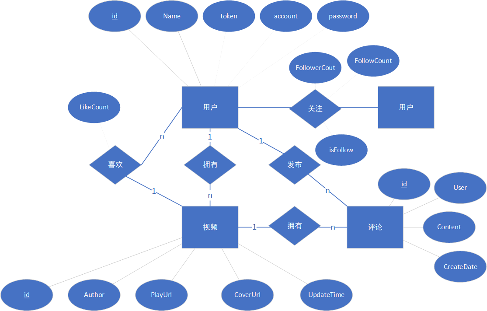
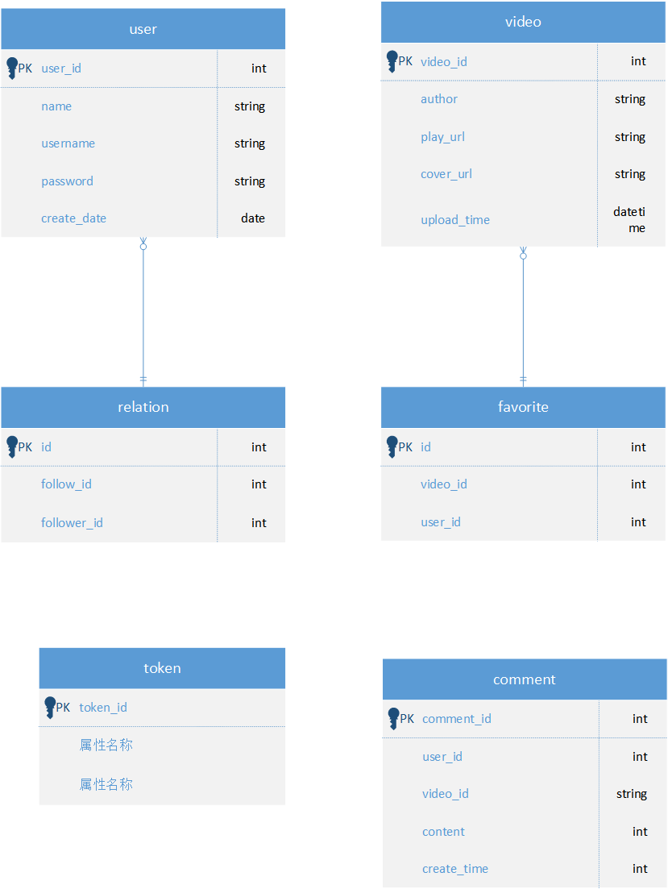
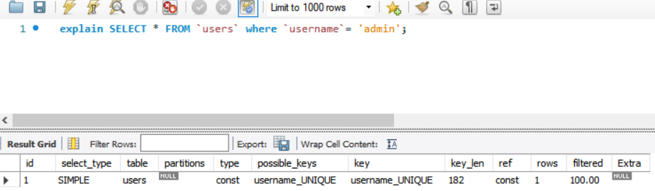

# TikTokLite

## 字节青训营项目

具体功能内容参考飞书说明文档

工程无其他依赖，直接编译运行即可

```shell
go build && ./tiktok-lite
```

## 接口说明/Controller
视频上传后会保存到本地 public 目录中，访问时用 http://{ip}:8080/static/{video_name} 即可

### 基础接口
* 视频流 Feed ``/douyin/feed/`` 
* 获取用户信息 UserInfo ``/douyin/user/`` 
* 用户注册 Register ``/douyin/user/register/``
* 用户登录 Login ``/douyin/user/login/``
* 视频投稿 Publish ``/douyin/publish/action/``
* 获取投稿信息 PublishList ``/douyin/publish/list/``

### 点赞接口
* 点赞操作 FavoriteAction ``/douyin/favorite/action/``
* 点赞列表 FavoriteList ``/douyin/favorite/list/``
* 评论操作 CommentAction ``/douyin/comment/action/``
* 评论列表 CommentList ``/douyin/comment/list/``

### 关注接口
* 关注操作 RelationAction ``/douyin/relation/action/``
* 关注列表 FollowList ``/douyin/relation/follow/list/``
* 粉丝列表 FollowerList ``/douyin/relation/follower/list/``

## 功能说明/Service
TODO 功能已实现，文档待补充
### 基本功能
TODO token生成算法
### 点赞功能

### 关注功能


## 数据库设计/Dao

### E-R图


### 数据库表鱼脚图


## 性能和安全

### sql优化
使用Explain可以查看sql的性能瓶颈信息，并根据结果进行sql的相关优化。在select 语句前加上explain关键字，执行的时候并不会真正执行sql语句，而是返回sql查询语句对应的执行计划信息。

其中type字段决定mysql如何查找表中的数据，查找数据记录的大概范围。从最优到最差分别为system > const > eq_ref > ref > range > index > all。
all表示全表扫描，性能最差，可以通过增加索引来优化，一般优化到range就可以了。

### sql注入
TODO

## 测试
TODO 测试
