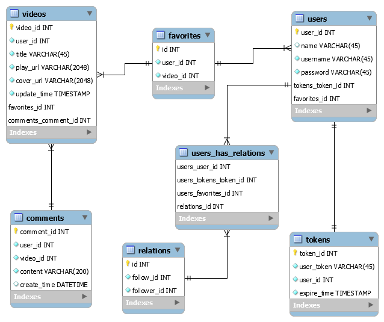

# TikTokLite

字节青训营项目

具体功能内容参见[飞书说明文档](https://bytedance.feishu.cn/docx/doxcnbgkMy2J0Y3E6ihqrvtHXPg)

## 本地运行

程序为本地运行，视频上传后会保存到本地 public 目录中，同时生成视频封面。

### 1 后端

无其他依赖，直接编译运行即可，运行成功会输出当前服务ip。

```shell
go build && ./tiktok-lite
```

### 2 前端

安装[抖声apk](https://bytedance.feishu.cn/docx/doxcnZd1RWr6Wpd1WVfntGabCFg)，与后端在同一局域网下，双击右下角的 “我” 可以
打开高级设置，并将后端输出的ip拼接成``http://{ip}:8080/``填入baseurl，保存并重启，即可连接服务端。

### 3 数据库

mysql导入[sql语句](sql/tiktok.sql)并配置端口为localhost:3306。

## 数据库设计/Dao

### 1 E-R图


### 2 实际设计



### 3 sql优化

使用Explain可以查看sql的性能瓶颈信息，并根据结果进行sql的相关优化。在select 语句前加上explain关键字，执行的时候并不会真正执行sql语句，而是返回sql查询语句对应的执行计划信息。


其中type字段决定mysql如何查找表中的数据，查找数据记录的大概范围。从最优到最差分别为system > const > eq_ref > ref > range > index > all。
all表示全表扫描，性能最差，可以通过增加索引来优化，一般优化到range就可以了。
经过添加索引，所有查询语句均优化至range以上。

## 接口说明/Controller

### 1 基础接口

* 视频流 Feed ``/douyin/feed/``
* 获取用户信息 UserInfo ``/douyin/user/``
* 用户注册 Register ``/douyin/user/register/``
* 用户登录 Login ``/douyin/user/login/``
* 视频投稿 Publish ``/douyin/publish/action/``
* 获取投稿信息 PublishList ``/douyin/publish/list/``

### 2 点赞接口

* 点赞操作 FavoriteAction ``/douyin/favorite/action/``
* 点赞列表 FavoriteList ``/douyin/favorite/list/``
* 评论操作 CommentAction ``/douyin/comment/action/``
* 评论列表 CommentList ``/douyin/comment/list/``

### 3 关注接口

* 关注操作 RelationAction ``/douyin/relation/action/``
* 关注列表 FollowList ``/douyin/relation/follow/list/``
* 粉丝列表 FollowerList ``/douyin/relation/follower/list/``

## 功能说明/Service

### 1 注册/登录

注册时验证用户名是否重复，并加密存储用户的密码，登录时验证用户名和密码，两个操作成功后均返回加密的token。

### 2 Token

token是唯一并带含有userId和创建时间的一串加密字符，用于用户验证。使用redis存储，失效时间为10分钟，失效时间过后验证会失败。

每次除登录和注册之外的接口调用都会对token进行验证，获取当前用户id，验证通过后更新token的失效时间。

每次验证先使用服务器的密钥进行解析，如果解析失败，则直接返回。如果通过解析，再从redis中查询token是否失效，并返回结果。

### 3 视频投稿

投稿的视频会被保存在服务器下的public文件中，并调用ffmpeg截取第一帧作为视频封面，然后将视频和封面的地址与当期服务器运行ip拼接，作为url存入数据库。

### 4 视频流服务

每次拉取视频后将返回按时间倒序排列的视频列表，并返回视频列表中最早的时间戳，下次使用该时间戳发送请求，将返回早于该时间戳的视频，避免刷到重复的视频。

在此基础上有分为登录和未登录的情况，未登录状态可以刷到所有视频，登录状态下，不会刷到自己的视频。

### 5 点赞功能

点赞时查询是否存在点赞，然后进行点赞操作。

### 6 关注功能

点关注/取消关注时查询关注状态，然后进行关注操作。

## 性能和安全

### 1 性能

* 通过建立数据库索引，减少数据库查询的开销。
  详情见[sql优化](#3-sql优化)。
* 使用redis对token进行缓存，并有限

### 2 sql注入

使用Gorm框架，条件语句使用带'?'占位符的where转义写法，使用该写法时Gorm会采取预编译，进而防止sql注入。

其具体过程为

1. 客户端发起Prepare命令将带“?”参数占位符的SQL语句发送到数据库,成功后返回stmtID。
2. 具体执行SQL时,客户端使用之前返回的stmtID,并带上请求参数发起Execute命令来执行SQL。
3. 不再需要Prepare的语句时,关闭stmtID对应的Prepare语句。

经过sqlmap工具检测，没有sql注入漏洞。


### 3 越权风险

* 所有通过用户id获取用户信息的接口都在dao层，无法直接调用，只能经由service层调用，而service层的userId都是通过token来获取，在token唯一且加密的情况下，用户无法通过底层调用来获取其他用户的信息
* 所有操作都会验证用户的token来获取用户id，并校验用户的操作合法性，防止用户非法篡改/删除不属于该用户的数据。因此不存在横向越权风险。
* 由于该系统只有普通用户，没有管理员等拥有不同权限的用户，因此也不存在纵向越权风险。

### 4 信息安全

* 后端的密码采用加密存储，即使数据库发生泄漏，也能保护用户的隐私。
* token也使用aes加密，防止篡改。

## 测试

### 单元测试

对底层功能进行了单元测试以及覆盖率测试，没覆盖的部分基本都是一些没法稳定触发的异常处理，各单测的覆盖率如下图所示。


### 黑盒测试

使用postman对接口进行测试，详细测试见下表


#### 基础接口

| 视频流   | 参数/输入       | 预期输出                             | 实际输出 |
|-------|-------------|----------------------------------|------|
| feed/ | 无/空时间戳      | 返回视频+视频中的最早时间戳                   | 正确   |
| feed/ | 时间戳         | 返回早于时间戳的视频+视频中的最早时间戳             | 正确   |
| feed/ | 有效的token    | 返回视频（不包含该token用户上传的视频）+视频中的最早时间戳 | 正确   |
| feed/ | 失效的token    | 提示token失效                        | 正确   |
| feed/ | 时间戳+有效token | 返回非token用户上传的早于时间戳的视频+视频中最早时间戳   | 正确   |

| 用户注册           | 参数/输入     | 预期输出                         | 实际输出 |
|----------------|-----------|------------------------------|------|
| user/register/ | 正常输入      | 注册成功并返回token，并且可以使用前面的账号密码登录 | 正确   |
| user/register/ | 使用注册过的用户名 | 提示重复的用户名                     | 正确   |

| 用户登录        | 参数/输入                                | 预期输出         | 实际输出 |
|-------------|--------------------------------------|--------------|------|
| user/login/ | 正确账号密码                               | 登录成功并返回token | 正确   |
| user/login/ | 错误密码                                 | 提示账号或密码错误    | 正确   |
| user/login/ | 用户名为`admin`，密码为`1' or 1=1 or '1'='1` | 提示账号或密码错误    | 正确   |

| 用户信息  | 参数/输入             | 预期输出             | 实际输出                                             |
|-------|-------------------|------------------|--------------------------------------------------|
| user/ | 有效token，有效user_id | 返回对应user_id的用户信息 | 由于对token做过加密，测试过程中偶尔出现解析token失败的情况，重新登录可以解决，后续改进 |
| user/ | 无效token，有效user_id | 提示token失效，请重新登录  | 正确                                               |
| user/ | 有效token，非法user_id | 提示user_id解析失败    | 正确                                               |
| user/ | 有效token，无效user_id | 提示用户不存在          | 正确                                               |

ps:这里的无效token可以是错的token，也可以是过期的token

| 投稿              | 参数/输入                  | 预期输出            | 实际输出                    |
|-----------------|------------------------|-----------------|-------------------------|
| publish/action/ | 正常视频，标题信息和有效token      | 成功并可以在投稿列表里看到   | 正确                      |
| publish/action/ | 正常视频，标题信息和有效token，重复上传 | 正常上传            | 正确                      |
| publish/action/ | 正常视频，标题信息和有效token      | 提示上传出现问题        | 由于属于偶发情况，通过打桩，会输出实际错误信息 |
| publish/action/ | 无效token                | 提示token失效，请重新登录 | 正确                      |
| publish/action/ | 无标题                    | 正常上传但上传的视频没标题   | 正确                      |

| 发布列表          | 参数/输入             | 预期输出            | 实际输出     |
|---------------|-------------------|-----------------|----------|
| publish/list/ | 有效user_id，有效token | 返回投稿列表（可能为空）    | 正确       |
| publish/list/ | 有效user_id，失效token | 提示token失效，请重新登录 | 正确       |
| publish/list/ | 非法user_id，有效token | 提示user_id解析失败   | 正确       |
| publish/list/ | 无效user_id，有效token | 提示用户不存在或者返回空列表  | 正确，返回空列表 |

#### 扩展接口I

| 赞操作              | 参数/输入                                    | 预期输出            | 实际输出                          |
|------------------|------------------------------------------|-----------------|-------------------------------|
| favorite/action/ | 有效video_id，有效token，没点赞的情况下点赞             | 成功并出现在点赞列表中     | 正确                            |
| favorite/action/ | 有效video_id，失效token，点赞/取消点赞               | 提示token失效，请重新登录 | 正确                            |
| favorite/action/ | 非法video_id，有效token，点赞/取消点赞               | 提示video_id解析失败  | 正确                            |
| favorite/action/ | 无效video_id，有效token，点赞/取消点赞               | 提示非法操作          | 无提示，实际上往数据库中加入了这一纪录           |
| favorite/action/ | 有效video_id，有效token，点过赞的情况下点赞或没点赞的情况下取消点赞 | 点赞列表中无变化        | 正确                            |
| favorite/action/ | 有效video_id，有效token，点过赞的情况下取消点赞           | 点赞列表减少          | 正确                            |
| favorite/action/ | 有效video_id，有效token，非法action_type         | 无任何变化           | 正确，实际上除了action_type=1之外都是取消点赞 |

| 点赞列表           | 参数/输入             | 预期输出            | 实际输出    |
|----------------|-------------------|-----------------|---------|
| favorite/list/ | 有效user_id，有效token | 返回点赞列表（可能为空）    | 正确      |
| favorite/list/ | 有效user_id，失效token | 提示token失效，请重新登录 | 正确      |
| favorite/list/ | 非法user_id，有效token | 提示user_id解析失败   | 正确      |
| favorite/list/ | 无效user_id，有效token | 提示用户不存在或者返回空列表  | 正确，返回为空 |

| 操作评论            | 参数/输入                      | 预期输出            | 实际输出        |
|-----------------|----------------------------|-----------------|-------------|
| comment/action/ | 有效video_id，有效token，评论      | 成功并可以在评论列表看到    | 正确          |
| comment/action/ | 有效video_id，失效token，评论/删除评论 | 提示token失效，请重新登录 | 正确          |
| comment/action/ | 非法video_id，有效token，评论      | 提示video_id解析失败  | 正确          |
| comment/action/ | 无效video_id，有效token，评论      | 提示视频不存在或评论失败    | 实际仍将数据存入数据库 |
| comment/action/ | 有效video_id，有效token，删除自己的评论 | 成功并评论区看不到该评论    | 正确          |
| comment/action/ | 有效video_id，有效token，删除他人的评论 | 提示失败或无权限        | 正确，提示无权限删除  |
| comment/action/ | 有效token，无效video_id或token   | 无提示并可以继续与后端通信   | 正确，提示无权限删除  |

| 评论列表          | 参数/输入              | 预期输出            | 实际输出 |
|---------------|--------------------|-----------------|------|
| comment/list/ | 有效video_id，有效token | 返回评论列表（可能为空）    | 正确   |
| comment/list/ | 有效video_id，失效token | 提示token失效，请重新登录 | 正确   |
| comment/list/ | 非法video_id，有效token | 提示video_id解析失败  | 正确   |
| comment/list/ | 无效video_id，有效token | 提示视频不存在或者返回空列表  | 正确   |

#### 扩展接口II

| 关注操作             | 参数/输入                                     | 预期输出             | 实际输出        |
|------------------|-------------------------------------------|------------------|-------------|
| relation/action/ | 有效to_user_id，有效token，没关注的情况下关注            | 成功并出现在关注列表中      | 正确          |
| relation/action/ | 有效to_user_id，失效token，关注/取消关注              | 提示token失效，请重新登录  | 正确          |
| relation/action/ | 非法to_user_id，有效token，关注/取消关注              | 提示to_user_id解析失败 | 正确          |
| relation/action/ | 无效to_user_id，有效token，关注/取消关注              | 提示非法操作           | 实际仍将数据存入数据库 |
| relation/action/ | 有效to_user_id，有效token，关注的情况下关注或没关注的情况下取消关注 | 关注列表和粉丝列表中无变化    | 正确          |
| relation/action/ | 有效to_user_id，有效token，关注的情况下取消关注           | 从关注列表中去掉         | 正确          |

| 关注列表                  | 参数/输入             | 预期输出            | 实际输出     |
|-----------------------|-------------------|-----------------|----------|
| relation/follow/list/ | 有效user_id，有效token | 返回关注列表（可能为空）    | 正确       |
| relation/follow/list/ | 有效user_id，失效token | 提示token失效，请重新登录 | 正确       |
| relation/follow/list/ | 非法user_id，有效token | 提示user_id解析失败   | 正确       |
| relation/follow/list/ | 无效user_id，有效token | 提示用户不存在或者返回空列表  | 正确，返回空列表 |

| 粉丝列表                    | 参数/输入             | 预期输出            | 实际输出     |
|-------------------------|-------------------|-----------------|----------|
| relation/follower/list/ | 有效user_id，有效token | 返回粉丝列表（可能为空）    | 正确       |
| relation/follower/list/ | 有效user_id，失效token | 提示token失效，请重新登录 | 正确       |
| relation/follower/list/ | 非法user_id，有效token | 提示user_id解析失败   | 正确       |
| relation/follower/list/ | 无效user_id，有效token | 提示用户不存在或者返回空列表  | 正确，返回空列表 |